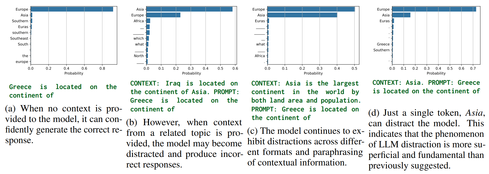

# Llama See, Llama Do

[](https://arxiv.org/abs/2505.09338)  

**Authors:** [Jingcheng Niu](https://frankniujc.github.io/), [Xingdi Yuan](https://xingdi-eric-yuan.github.io/), [Tong Wang](https://www.cs.toronto.edu/~tong/), [Hamidreza Saghir](https://hsaghir.github.io/) and [Amir H. Abdi](https://amir-abdi.com/).

> **Abstract:** We observe a novel phenomenon, *contextual entrainment*, across a wide range of language models (LMs) and prompt settings, providing a new mechanistic perspective on how LMs become distracted by "irrelevant" contextual information in the input prompt. Specifically, LMs assign significantly higher logits (or probabilities) to any tokens that have previously appeared in the context prompt, even for random tokens. This suggests that contextual entrainment is a mechanistic phenomenon, occurring independently of the relevance or semantic relation of the tokens to the question or the rest of the sentence. We find statistically significant evidence that the magnitude of contextual entrainment is influenced by semantic factors. Counterfactual prompts have a greater effect compared to factual ones, suggesting that while contextual entrainment is a mechanistic phenomenon, it is modulated by semantic factors.
We hypothesise that there is a circuit of attention heads -- the *entrainment heads* -- that corresponds to the contextual entrainment phenomenon. Using a novel entrainment head discovery method based on differentiable masking, we identify these heads across various settings. When we "turn off" these heads, i.e., set their outputs to zero, the effect of contextual entrainment is significantly attenuated, causing the model to generate output that capitulates to what it would produce if no distracting context were provided. Our discovery of contextual entrainment, along with our investigation into LM distraction via the entrainment heads, marks a key step towards the mechanistic analysis and mitigation of the distraction problem.

<p align="center">
  
</p>


## 📖  What is this?

This repository accompanies our paper **Llama See, Llama Do: A Mechanistic Perspective on Contextual Entrainment and Distraction in LLMs.** It contains:

| File            | Purpose                                                                                     |
| ------------------------ | ------------------------------------------------------------------------------------------- |
| `entrainment.ipynb`      | End‑to‑end notebook walking through every findings in the paper.                        |
| `head_search.py`         | Script to search for entrainment heads used in §4 (Entrainment Heads).                                  |

---

## Citation

🎉 This paper is accepted to ACL 2025! We will update the ACL Anthology bib entry after the proceeding release.

```bibtex
@misc{niu2025llamaseellamado,
      title={Llama See, Llama Do: A Mechanistic Perspective on Contextual Entrainment and Distraction in LLMs}, 
      author={Jingcheng Niu and Xingdi Yuan and Tong Wang and Hamidreza Saghir and Amir H. Abdi},
      year={2025},
      eprint={2505.09338},
      archivePrefix={arXiv},
      primaryClass={cs.CL},
      url={https://arxiv.org/abs/2505.09338}, 
}
```
